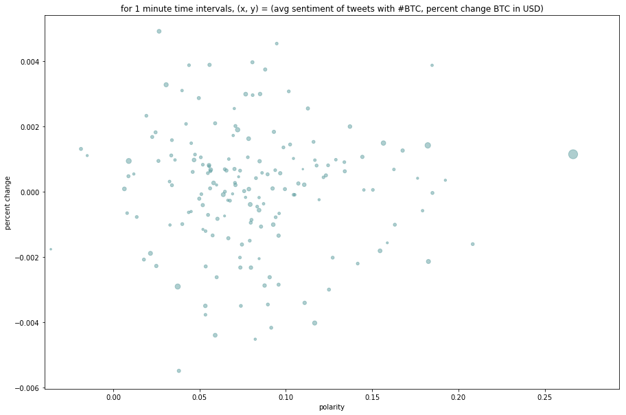
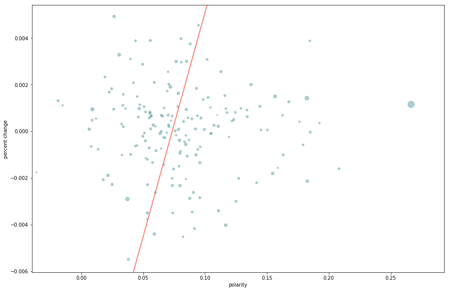
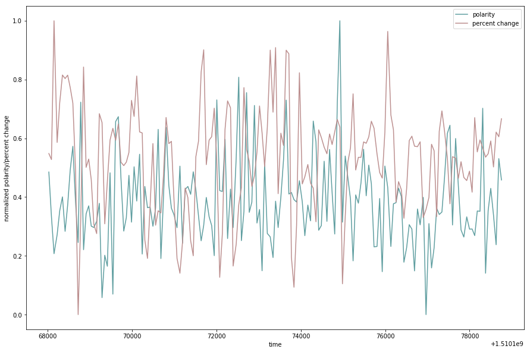
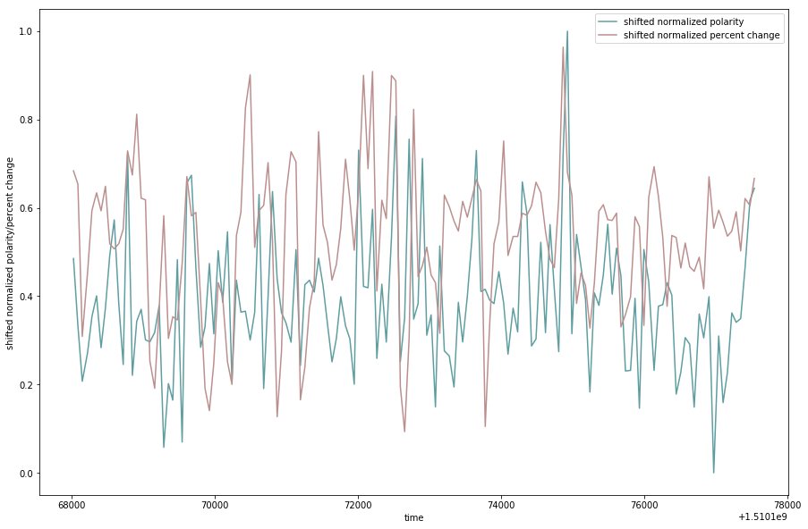

## BTC price as a function of twitter sentiment

I had the idea that the sentiment of tweets containing #BTC could be an indicator for fluctuations in the price of BTC. I started by writing the python program [preprocessing.py](https://github.com/stoksc/ccpredict/blob/master/preprocessing.py "twitter data getter"). This program gathers tweets from using a Tweepy stream listener and then scores them all individually after some cleaning up and exports the scores and percent change in BTC price, along with some other stuff. Used some code from this [blog post](https://marcobonzanini.com/2015/03/02/mining-twitter-data-with-python-part-1/) to get started.

The heart of my idea was that:

    percent change is proportional to sentiment

I also had a hunch that the volume in a time period would amplify the dependency on sentiment so that:

    percent change is proportional to sentiment times tweet volume

And this is a really simple idea about something so complicated; I imagine it is bound to be wrong but python facilitates testing these ideas only small time investments.

First, I decided to plot the data gathered to see if there was a correlation.


```python
import os
import pickle
import numpy as np
import matplotlib
import matplotlib.pyplot as plt

with open(os.getcwd() + '\\' + 'btc_data.txt', 'rb') as f:
    btc_data = pickle.load(f)
    polarity = np.array([])
    percent_chg = np.array([])
    tweet_volume = np.array([])
    start_times = np.array([])
    end_times = np.array([])
    if (len(btc_data) % 2) == 1:
        btc_data = btc_data[1::]
    for entry in btc_data:
        if entry['start time'] < 1510197000:
            polarity = np.append(polarity, entry['polarity'])
            percent_chg = np.append(percent_chg, entry['percent change'])
            tweet_volume = np.append(tweet_volume, entry['tweet volume'])
            start_times = np.append(start_times, entry['start time'])
            end_times = np.append(end_times, entry['end time'])

plt.scatter(polarity, percent_chg, s=tweet_volume, alpha=0.5, color='#5f9ea0')
x_min, x_max = np.amin(polarity), np.amax(polarity)
y_min, y_max = np.amin(percent_chg), np.amax(percent_chg)
plt.title('for 1 minute time intervals, (x, y) = (avg sentiment of tweets with #BTC, percent change BTC in USD)')
plt.xlabel('polarity')
plt.xlim(1.1*x_min, 1.1*x_max)
plt.ylabel('percent change')
plt.ylim(1.1*y_min, 1.1*y_max)
matplotlib.rcParams['figure.figsize'] = [15.0, 10.0]
plt.show()  
```





So, unfortunately, there isn't really any strong correlation but I wanted to play with tensorflow a bit anyway so I read through the [getting started](https://www.tensorflow.org/get_started/get_started). I borrowed and altered (barely) some code to model the relationship I described above and find the proportionality constants. 


```python
import tensorflow as tf

assert not np.any(np.isnan(polarity))
assert not np.any(np.isnan(percent_chg))
assert not np.any(np.isnan(tweet_volume))

def model_fn(features, labels, mode):
    W = tf.get_variable("W", [1], dtype=tf.float64)
    b = tf.get_variable("b", [1], dtype=tf.float64)
    y = W*features['x1'] + b
    loss = tf.reduce_sum(tf.square(y - labels))
    global_step = tf.train.get_global_step()
    optimizer = tf.train.GradientDescentOptimizer(0.01)
    train = tf.group(optimizer.minimize(loss),
                   tf.assign_add(global_step, 1))
    return tf.estimator.EstimatorSpec(
        mode=mode,
        predictions=y,
        loss=loss,
        train_op=train)

tf.logging.set_verbosity(tf.logging.ERROR)

estimator = tf.estimator.Estimator(model_fn=model_fn)
x1_train = polarity
y_train = percent_chg
input_fn = tf.estimator.inputs.numpy_input_fn(
    {"x1": x1_train}, y_train, batch_size=4, num_epochs=None, shuffle=True)
train_input_fn = tf.estimator.inputs.numpy_input_fn(
    {"x1": x1_train}, y_train, batch_size=4, num_epochs=1000, shuffle=False)

estimator.train(input_fn=input_fn, steps=1000)
train_metrics = estimator.evaluate(input_fn=train_input_fn)
print("train loss: %r"% train_metrics['loss'])
W, b = estimator.get_variable_value('W')[0],  estimator.get_variable_value('b')[0]
print('y = {}*x1 + {}'.format(W, b))

y1 = W*x_min + b
y2 = W*x_max + b
plt.scatter(polarity, percent_chg, s=tweet_volume, alpha=0.5, color='#5f9ea0')
plt.plot([x_min, x_max], [y1, y2], color='#fa8072', linestyle='-', linewidth=2)
plt.xlabel('polarity')
plt.xlim(1.1*x_min, 1.1*x_max)
plt.ylabel('percent change')
plt.ylim(1.1*y_min, 1.1*y_max)
plt.show()
```

    train loss: 0.00033625914
    y = 0.1921803505396604*x1 + -0.014125128765346454





Any what I was expecting, a random line to go with the noise I'm calling 'data'. But I got to play with tensorflow a bit.

I tried to find a relation with the idea of polarity times tweet volume using the model_fn
    
    y = W*features['x1']*features['x2'] + b         
    
passing tweet_volume but the model kept diverging. I didn't have much time so I just stuck to linear regression with one feature, polarity. And with this, the model converges to a different line almost every run; meaning the dataset is more random than anything else. 

Then the bright idea came to me, maybe there is a correlation but they are just out of phase so I normalized the values to the interval [0, 1] and plotted them both together against time to see if I could see anything.


```python
def normalize(np_arr):
    arr_min = np.amin(np_arr)
    np_arr -= arr_min
    np_arr /= np.amax(np_arr - np.amin(np_arr))
    return np_arr

polarity = normalize(polarity)
percent_chg = normalize(percent_chg)
polline, = plt.plot(start_times, polarity, color='#5f9ea0', label='polarity')
prcline, = plt.plot(start_times, percent_chg, color='#bc8f8f', label='percent change')
plt.xlabel('time')
plt.ylabel('normalized polarity/percent change')
plt.legend(handles=[polline, prcline])
plt.show()
```





So, uh... not too obvious? 

But that just leads me to a more interesting problem: calculating the phase difference of two signals. I could find the how similar the signals are by finding the distance between their fourier transforms. If they would decompose into the frequency domain this might work well but the randomness of the patterns made me believe they wouldn't. 

I decided to run the two signals at each other and minimize the square difference. It has to be normalized or else the iteration where only one point is overlapping would have the least square. To normalize it, I divide the total square difference by the number of overlapping points.

This is sort of like the minimum of the convolution of the two functions with the same sort of normalization (dividing by the length of overlap as we convolve the singals).


```python
def nconvolve(a1, a2, starting_overlap):
    shapes = s1, s2 = a1.shape[0], a2.shape[0]
    a1_l = s1 - starting_overlap
    a1_r = s1
    a2_l = 0
    a2_r = starting_overlap
    least_distance = 1000
    notDone = True
    while notDone:
        a12 = np.column_stack((a1[a1_l:a1_r], a2[a2_l:a2_r]))
        overlap = len(a12)
        distance = 0
        for pair in a12:
            distance += (pair[0] - pair[1])**2
        distance /= overlap
        if distance < least_distance:
            least_distance = distance
            la1_l = a1_l
            la1_r = a1_r
            la2_l = a2_l
            la2_r = a2_r
        if a1_l == 0:
            a1_r -= 1
            a2_l += 1
            if a1_r < starting_overlap:
                notDone = False
        if a1_l > 0:
            a1_l -= 1
            a2_r += 1
    return (la1_l, la1_r, la2_l, la2_r, least_distance)
    
minimum_overlap = int(len(polarity)/2)
rs = nconvolve(polarity, percent_chg, minimum_overlap)
print('polarity[{}:{}] seems to fit percent_chg[{}:{}] with a square difference of {}.'.format(rs[0],rs[1],rs[2],rs[3],rs[4]))
```

    polarity[0:151] seems to fit percent_chg[19:170] with a square difference of 0.05992873700132932.


It seems that polarity lags behind percent change by about 19 minutes. However, after looking at the list of square differences, this is only about 50% better than the average square difference, which isn't too convincing. I also added in a starting overlap amount to make sure the result was meaningful (which I think I've begun to lose altogether, already).


```python
polarity_shift = polarity[rs[0]:rs[1]]
percent_chg_shift = percent_chg[rs[2]:rs[3]]
start_times_shift = start_times[rs[0]:rs[1]]
tv_shift = tweet_volume[rs[0]:rs[1]]
polline, = plt.plot(start_times_shift, polarity_shift, color='#5f9ea0', label='shifted normalized polarity')
prcline, = plt.plot(start_times_shift, percent_chg_shift, color='#bc8f8f', label='shifted normalized percent change')
plt.xlabel('time')
plt.ylabel('shifted normalized polarity/percent change')
plt.legend(handles=[polline, prcline])
plt.show()
```





But, hey! Look at that, those big peaks happened to line up so that's pretty cool. But I'm not fooling myself. But I want to leave the time domain and see if there's a more obvious linear correlation between the shifted polarity and percent change.


```python
estimator = tf.estimator.Estimator(model_fn=model_fn)

x_train = polarity_shift
y_train = percent_chg_shift
input_fn = tf.estimator.inputs.numpy_input_fn(
    {"x1": x_train}, y_train, batch_size=4, num_epochs=None, shuffle=True)
train_input_fn = tf.estimator.inputs.numpy_input_fn(
    {"x1": x_train}, y_train, batch_size=4, num_epochs=1000, shuffle=False)

estimator.train(input_fn=input_fn, steps=1000)

train_metrics = estimator.evaluate(input_fn=train_input_fn)
print("train metrics: %r"% train_metrics)
W, b = estimator.get_variable_value('W')[0],  estimator.get_variable_value('b')[0]
print('y = {}*x1 + {}'.format(W, b))

y1 = W*x_min + b
y2 = W*x_max + b
plt.scatter(polarity_shift, percent_chg_shift, s=tweet_volume, alpha=0.5, color='#5f9ea0')
plt.plot([0, 1], [y1, y2], color='#fa8072', linestyle='-', linewidth=2)
plt.title('shifted normalized percent change vs shifted normalized polarity')
plt.xlabel('shifted normalized polarity')
plt.xlim(0, 1)
plt.ylabel('shifted normalized percent change')
plt.ylim(0, 1)
plt.show()
```

    train metrics: {'loss': 0.11034768, 'global_step': 1000}
    y = 0.41588630003169313*x1 + 0.370582965071245


### Conclusion

And it's almost no better than it was. Still not anything to bet on - which was sort of the goal. I think it would give more conclusive results if I had more data and better data; I don't think the process I worked through in this notebook was inherently bad.

I may go back in the future to [preprocessing.py](https://github.com/stoksc/ccpredict/blob/master/preprocessing.py) and change what data I'm gathering (adding new features), let it gather much longer and for more time intervals (1 minute/10 minute intervals were all I tried here) and alter the way I'm doing the sentiment analysis (I think it's pretty bad). But for now, finals are approaching. 
